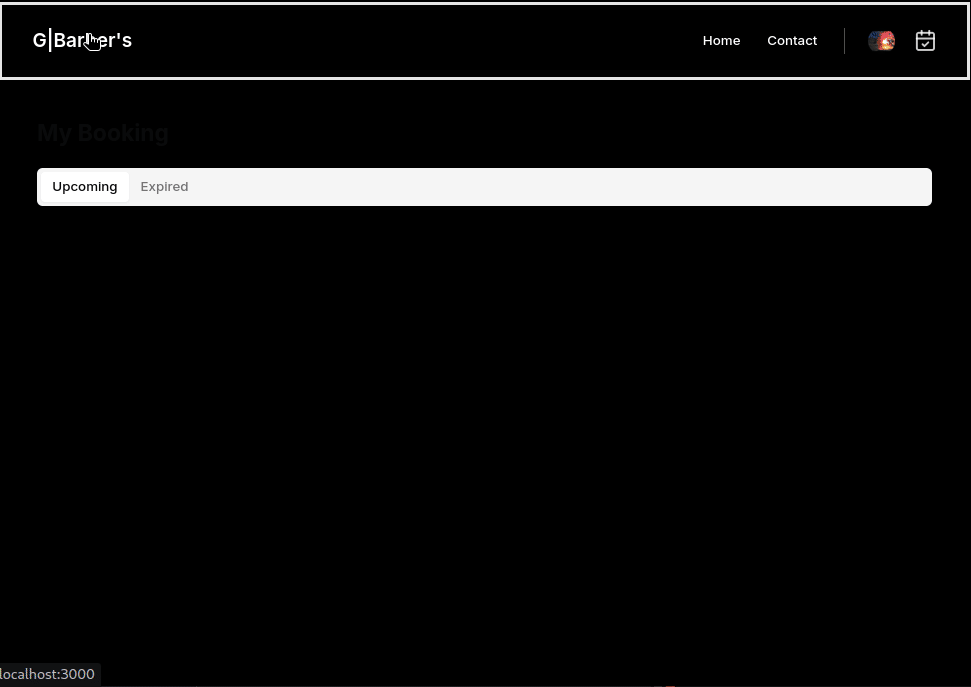

# G|Barbers: Streamlined Haircut Booking & Management | Next.js & TailwindCSS

Welcome to G|Barbers! This project is currently in the development stages and aims to provide a streamlined solution for booking and managing haircuts at barber shops. With GBarbers, clients can easily schedule appointments, while barbers can efficiently manage their schedules and client bookings.

## Project Overview

G|Barbers is a web application built using Next.js and TailwindCSS to address the needs of barbershops. It focuses on simplifying the appointment booking process for clients and providing efficient schedule management tools for barbers.

### Features:

- **Client Appointment Booking:** Clients can easily log in and book available time slots for their haircuts.
- **Authentication:** Secure user authentication process for clients to log in and book appointments.
- **Kinde Authentication:** Utilizes Kinde for secure user authentication.
- **Strapi Backend:** Strapi is used as the backend to store and manage booked slots, handle user authentication, and securely manage data.

## About the Project

This project is being developed for my own personal barber who owns a haircut shop. The primary goal is to create an application that allows clients to log in and book time slots for haircuts. Additionally, there will be features for the barber to manage their schedules effectively, including the ability to add or remove booked slots in case of emergencies.

### Technologies Used:

- **Next.js & TailwindCSS:** Next.js is used for building the frontend, and TailwindCSS is used for styling.
- **Kinde Authentication:** Kinde is used for secure user authentication.
- **Strapi Backend:** Strapi is used as the backend to handle user authentication and store/manage data.

## Testing the Application

To test the application, follow these steps:

1. **Sign Up or Log In:** Use the provided credentials or sign up for a new account.
2. **Select Time Slots:** Navigate to the booking section and select available time slots for booking.
3. **Manage Bookings:** After booking an appointment, manage bookings by clicking on the booked time slot.
4. **Navigate Calendar Days:** Use the calendar interface to navigate between different days and book appointments for future dates.
5. **View Notifications:** The application provides notifications for various actions, such as successfully booking an appointment or encountering errors.

## Future Plans

As the project progresses, additional features and improvements will be implemented, including:

- Improved user interface and experience.
- Dashboard for the barber to manage appointments.
- Enhanced notification system for user interactions.
- Email notification

Stay tuned for updates as we progress with the development of GBarbers!

## Future Plans

coming.....

<!-- **[BETA DEMO -Link]** -->

Note: This project is currently under development. Any feedback or suggestions are highly appreciated. Thank you.
